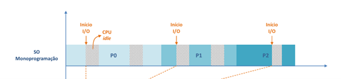

# Trabalho Pratico 1 - Sistemas Operativos

## Estrutura

- `ex1/parallel_exec.c`: executa `/bin/date` e `/bin/ping -c 4 www.google.com` em paralelo com `fork + exec` e recolhe os estados com `waitpid`.
- `ex2/count_words.c`: executa `wc -w <ficheiro>` num filho, captura o `stdout` por `pipe + dup2`, e imprime apenas o numero de palavras.
- `ex3/vector-seq.c`: versao sequencial com medicao de tempo por `clock_gettime`.
- `ex3/vector-seq-processes.c`: versao multiprocesso que divide intervalos do vetor por processos filhos e agrega `min/max/sum` no pai via `pipe`.
- `Makefile` (raiz e por exercicio): regras `all` e `clean`.

## Opções de implementação

- Tratamento sistematico de erros de syscalls (`fork`, `pipe`, `dup2`, `read`, `write`, `waitpid`, etc.).
- Fecho explicito dos descritores de ficheiros em pai e filhos.
- Espera por todos os processos filhos para evitar zombies.
- Seed fixa (`2026`) para reprodutibilidade dos resultados e comparacao de desempenho.

## Como compilar

Na raiz:

```bash
make
```

Ou por exercicio:

```bash
make -C ex1
make -C ex2
make -C ex3
```

## Execução

```bash
./ex1/parallel_exec
./ex2/count_words <ficheiro>
./ex3/vector-seq <dimensao>
./ex3/vector-seq-processes <dimensao> <num_processos>
```

## Parte III - Verdadeiro/Falso

### 4.a

1. **Nos sistemas operativos multiprogramados quando um processo realiza uma operação de espera de um determinado tempo, e.g. sleep(1), o SO escolhe outro processo para continuar a executar-se.** <br>
R: V - Enquanto está no wait-time, o sistema operativo escolhe outro processo para ser executado <br>

2. **Nos sistemas operativos multiprogramados se um processo executar este ciclo infinito `while (1) { /* ... */ }` o SO suspende a execução desse processo para dar oportunidade dos outros processos se executarem** <br>
R: V -  Por ser um sistema operativo multiprogramado, o programa executa outras operações além desta. Além disso, possui um tempo limite para a sua execução. <br>

3. **CPU idle é o tempo de processador não utilizado para executar código dos processos ou do próprio SO.** <br>
R: V -  Como podemos observar pela seguinte imagem, o CPU idle é o tempo que o processador fica à espera até que outra operação aconteça.



4. **Os sistemas operativos multi-utilizadores seguem as mesmas regras dos sistemas multiprogramados adicionado um tempo máximo que um processo pode utilizar um processador.** <br>
R: F - Pela imagem abaixo, conseguimos perceber que em sistemas operativos multiutilizadores, as mesmas regras são seguidas (mesma ordem, tempo CPU idle no final), porém é introduzido um limite máximo de tempo de execução por operação antes de haver interrupção (time slice). <br>


### 4.b

```c
int main()
{
    fork();

    fork();

    fork();

    printf("Finishing\n");
    return 0;
}
```

1. **A execução deste código irá originar além do processo principal mais 3 processos.** <br>
R: F - (justificação na Resposta 2) <br>

2. **A execução deste código irá originar além do processo principal mais 7 processos.** <br>
R: V - Existem 3 forks. Como existem 3 forks, o número de processos será 2^n (forks). 2^3 = 8. Desses 8, um é o original, os outros 7 são processos filho. <br>

3. **Neste código enquanto o processo pai executa a linha 10 pode verificar-se processos zombies (defuncts) através da utilização do comando ps.** <br>
R: V - Enquanto o processo pai executa a linha 10, os processos filho já podem ter terminado a sua execução.Pelo facto do processo pai ainda se encontrar ocupado/ativo na linha 10 e não ter sido chamado o wait() para recolher o estado dos processos filho, estes permanecem na tabela de processos do sistema como zombies. <br>

4. **A linha 10 neste código é executada apenas pelo processo pai.** <br>
R: F - Todos os processos executam esta linha de código. Isto pois não há nenhuma condição que delimite os processos filho. Ou seja, fork() vai criar processos que continuam a executar o mesmo código a partir da instrução seguinte. <br>

### 4.c

1. **Se o processo pai termina antes do processo filho, o processo filho aborta a sua execução.** <br>
R: F - Se o processo pai termina antes do processo filho, o processo filho continua a executar o seu código, ficando um processo orfão. <br>

2. **Se o processo pai termina antes do processo filho, o processo filho fica no estado zombie.** <br>
R: F - Isto acontece apenas quando o processo filho termina primeiro que o processo pai, mas o processo pai ainda não executou wait(). <br>

3. **Se o processo filho termina antes do processo pai, o processo filho fica no estado zombie.** <br>
R: V – Como visto acima, o processo filho só fica no estado zombie quando termina antes do processo pai. <br>

4. **Se o processo filho termina antes do processo pai, o processo filho fica órfão.** <br>
R: F – Falso. Teria de ser o contrário. Para o processo filho ser órfão, o processo pai teria de terminar primeiro. <br>

### 4.d

```c
int main ()
{
    for (int i = 0; i < 10; ++i) {
        execlp("date", "date", NULL);
        sleep(1);
    }
    return 0;
}
```

1. **Este programa executa o programa date, para imprimir a data e hora no standard de output, em intervalos de 1 segundo durante 10 segundos.** <br>
R: F - Após a primeira iteração bem sucedida, execlp vai fazer com que o programa termine. Ou seja, execlp sobrepõe o restante do código. <br>

2. **São criados 10 processos auxiliares para executarem o programa date ficando esses processos no estado zombie.** <br>
R: F - O execlp sobrepõe o restante do código, pelo que o programa date não é executado 10 vezes. Se criássemos um processo filho dentro do loop com fork(), e o processassemos corretamente, cada iteração poderia executar date independentemente, permitindo que todas as execuções fossem realizadas.<br>

3. **Este código apenas executa o programa date 1 única vez.** <br>
R: V - O execlp sobrepõe o restante do código, correndo apenas uma vez. <br>

4. **Este código deveria esperar pelos processos filho através da utilização da chamada de sistema waitpid().** <br>
R: Sabemos que para utilizar waitpid() precisaríamos primeiramente de chamar fork(), o que não é o caso do nosso código, visto que não temos fork().<br>