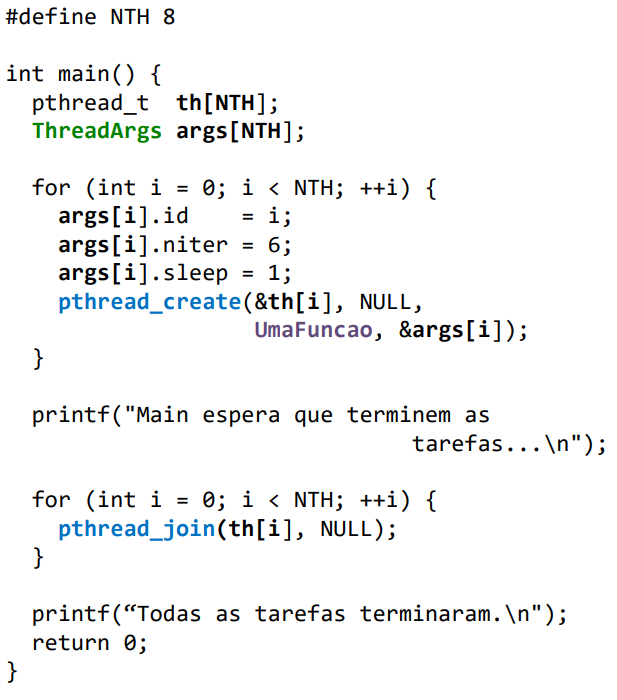

# Trabalho Pratico 2 - Sistemas Operativos

## Como compilar

```bash
make
```

## Execução

### Ex1
```bash
./Trab2/client unix <codigo_serviço>
./Trab2/client tcp <host> <porta> <codigo_serviço>
./trab2/server unix
./trab2/server tcp <porta>
./trab2/server both <porta>
```

### Ex2
```bash
./Trab2/ex2_compare <num_elementos> <num_workers>
```

### Ex3
```bash
./Trab2/ex3_server <porta>
./Trab2/ex3_client <host> <porta> <num_elementos> [num_ligacoes]
```

## Parte III - Verdadeiro/Falso

### 4.a

1. **A utilização da chamada de sistema fork() permite a execução de dois troços de código concorrentes com espaços de endereçamento separados.**
R: Verdadeiro. Porque a chamada de sistema fork() cria um processo filho que é uma cópia do processo pai. Cada processo tem o seu próprio espaço de endereçamento independente, ou seja, têm memória separada. Ambos continuam a executar a partir do ponto de chamada do fork(), logo, dois troços de código correm concorrentemente em espaços separados.

2. **A utilização da chamada de sistema pthread_create() permite a execução de dois troços de código concorrentes com espaços de endereçamento separados num mesmo processo.**
R: Falso. A pthread_create() cria uma nova tarefa dentro do mesmo processo. Tarefas partilham o mesmo espaço de endereçamento.

3. **A chamada de sistema execlp() cria um processo.**
R: Falso. O execlp() não cria um novo processo em vez disso cria um novo programa em que os seus segmentos de text, data, heap e stack são substituídos pelo novo programa. Quem cria um processo é o fork().

4. **A chamada de sistema pthread_join() permite esperar pela terminação da tarefa identificada no primeiro argumento da função.**
R: Verdadeiro. A pthread_join() bloqueia a tarefa chamadora até que a tarefa identificada no primeiro argumento termine. É o equivalente ao wait() para processos, mas para threads. Por exemplo, nos slides 14 há um exemplo de codigo **figura 1** em que essa chamada de sistema está num ciclo for, o que nos indica que, para passar para o próximo i, tem que realizar a função, o que equivale esperar que termine.



### 4.b

1. **O mecanismo de comunicação fifo (named pipe) apenas funciona entre processos com grau de parentesco.**
R: Falso. Os anonymous pipes é que exigem relação de parentesco. Os FIFOs implimentam um canal de comunicação idêntico a um anonymous pipes, porém, permanecem no sistema de ficheiros depois de terminada a sua utilização o que permite que qualquer processo não necessite de relação de parentesco.

2. **Os sockets do domínio UNIX e os fifos são identificados através de um ficheiro especial no sistema de ficheiros.**
R: Verdadeiro. Ambos existem como um ficheiro especial num sistema de ficheiros. 

3. **Nos sockets stream a função bind serve para associar o socket a uma tarefa.**
R: Falso. A função bind serve para associar um socket a endereço local e não a uma tarefa. 

4. **Os sockets são representados ao nível do núcleo do sistema operativo como um tipo de ficheiro e podem ser usados para o redireccionamento de I/O e a receção e envio de dados realizados através das funções de read() e write().**
R: Verdadeiro. Os socket são geridos ao nivel do kernel do SO por descritores de ficheiros e as chamadas de sistemas genéricas de I/O, como read() e write(), funcionam perfeitamente neles.

### 4.c

1. **A ordem de execução entre as tarefas criadas através de pthread_create() num processo é garantida pelo sistema operativo.** 
R: Falso. O sistema operativo utiliza um scheduler para decidir quando uma tarefa é executada. Esta ordem é não-determinística. Se for necessário impor uma ordem usamos mecanismo de sincronização como semáforos.

2. **Uma tarefa criada no estado detach, quando terminar os recursos associados a essa tarefa serão, automaticamente, libertados.** 
R: Verdadeiro. Os Threads em detached os recursos são libertados assim que terminam sem ser necessário chamar pthread_join().

3. **Uma tarefa criada no estado joinable, quando terminar os recursos associados a essa tarefa serão, automaticamente, libertados.** 
R: Falso. Quando a tarefa terminar a sua execução os seus recursos apenas são eliminados quando a operação de pthread_join() for realizado por outra tarefa.

4. **Cada tarefa criada com pthread_create() corre obrigatoriamente num processador diferente.**
R: Falso. Cada tarefa pode correr em processadores diferentes só se o sistema for multi-core, mas não é obrigatório. No entanto podem correr no mesmo CPU através do time-slicing.


### 4.d

1. **Para dividir o processamento por ações concorrentes de forma a maximizar a utilização de toda a capacidade de processamento do hardware.**
R: Válido. Em sistemas multicore, as threads permitem paralelismo real, utilizando recursos de hardware que estariam inativos, assim, maximiza a utilização do hardware disponivel.

2. **Para poder executar dois programas (ficheiros executáveis) diferentes em concorrência e de uma forma mais rápida.**
R: Inválido. As threads partilham o mesmo espaço de endereço, logo executam o código do mesmo programa. Para executar processos diferentes precisamos de múltiplos processos, usando fork() + exec(). 

3. **Para poder realizar operações I/O em simultâneo com outras operações num mesmo processo.**
R: Válido. Uma thread pode ficar bloqueada à espera de uma operação de I/O, enquanto outra thread do mesmo processo continua a fazer cálculos na CPU.

4. **Para ter a execução de dois troços de código concorrentes com espaços de endereçamento separados num mesmo processo.**
R: Inválido. Num mesmo processo as threads partilham sempre o mesmo espaço de endereço. Espaços separados implicam a criação de múltiplos processos, via fork(). 